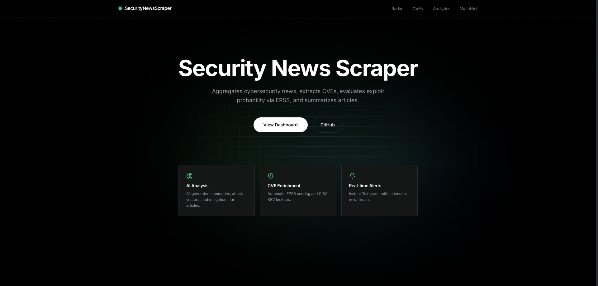
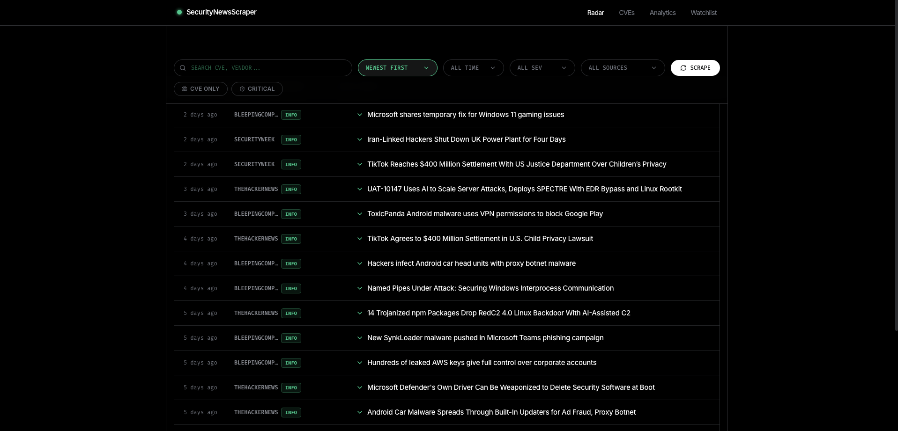
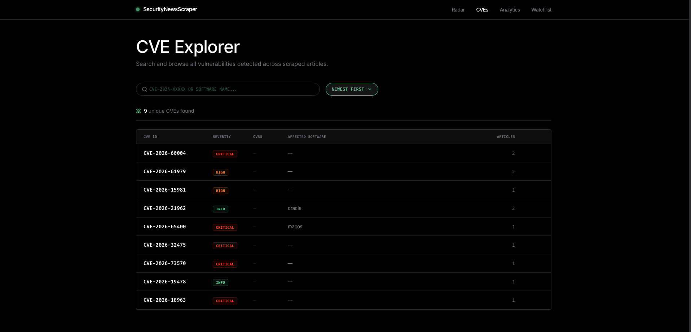
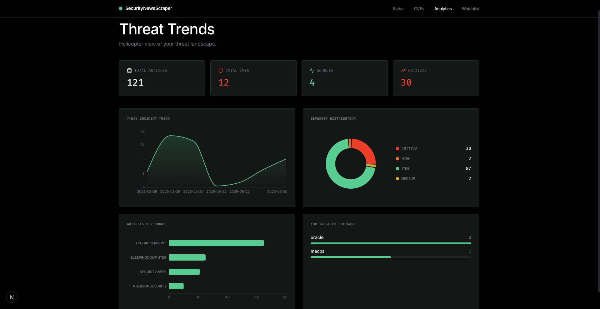
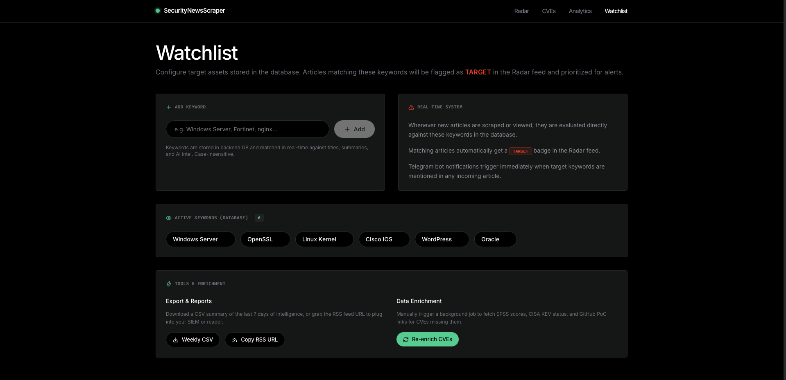
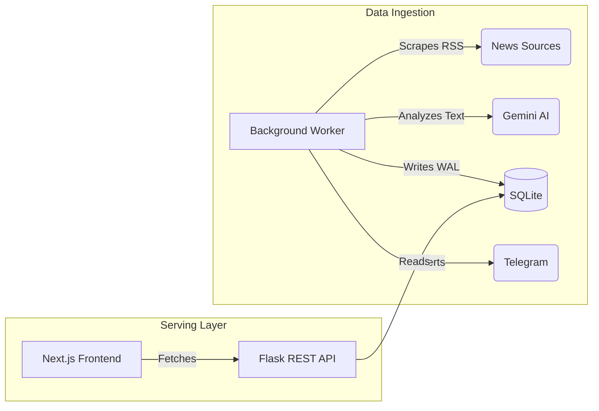

<div align="center">
  <h1>🛡️ SecurityNewsScraper (SNS)</h1>
  <p><b>Autonomous Threat Intelligence & Vulnerability Monitoring Platform</b></p>
  
  
  
  
  
  
</div>

<br />

<div align="center">
  
</div>

---

## ⚡ The Concept

Staying ahead of zero-days and critical vulnerabilities is a race against time. Traditional RSS readers are too noisy, and enterprise threat intelligence platforms are prohibitively expensive.

**SecurityNewsScraper (SNS)** bridges this gap. It is an autonomous agent that continuously scrapes top cybersecurity portals, uses AI to instantly extract mitigation steps and CVEs, and alerts you via Telegram before the exploit hits the mainstream.

## 🚀 Key Features

### 1. Autonomous Intelligence Radar
The system scrapes articles 24/7 in the background. The Gemini AI engine reads the full text of every article to extract **Attack Vectors**, **Mitigations**, and **Shodan Dorks**.


### 2. Unified Vulnerability (CVE) Database
Never miss a patch. The system automatically cross-references CVEs mentioned in the news and builds a searchable database sorted by severity and EPSS probability scores.


### 3. Actionable Telemetry & Analytics
Get a macro view of the threat landscape. Track 7-day incident trends, top targeted software, and severity breakdowns to prioritize your patching cycles.


### 4. Watchlist & Real-Time Alerting
Configure critical keywords (e.g., "Windows Server", "OpenSSL") in your Watchlist. If an incoming threat matches your stack, SNS sends a high-priority Telegram alert instantly.


---

## 🏗️ System Architecture

Designed for high concurrency and production readiness, SNS separates the data ingestion pipeline from the API layer.



- **Resilient AI**: Built-in exponential backoff ensures zero crashes even if the AI API hits rate limits.
- **SQLite WAL**: Write-Ahead Logging allows the background worker to write massive amounts of data without locking the database for the frontend users.

---

## 🛠️ Quick Start (Local)

### 1. Backend Setup
```bash
git clone https://github.com/angseleong/SecurityNewsScraper.git
cd SecurityNewsScraper

python -m venv venv
source venv/bin/activate

pip install -r backend/requirements.txt
cp backend/.env.example backend/.env
```
*Configure your `TELEGRAM_BOT_TOKEN`, `GEMINI_API_KEY`, and `ADMIN_SECRET` in `backend/.env`.*

```bash
# Initialize DB
python -c "from backend.database.db import init_db; init_db()"

# Terminal 1: Start API
PORT=5000 python -m backend.main

# Terminal 2: Start Scraper Daemon
python -m backend.worker
```

### 2. Frontend Setup
```bash
# Terminal 3
cd frontend
npm install
cp .env.local.example .env.local
npm run dev
```
*Access the dashboard at [http://localhost:3000](http://localhost:3000)*

---

## ☁️ Production Deployment

SNS is ready to be deployed on modern PaaS providers.

- **Backend (Render)**: Use the provided `render.yaml` to deploy both the API and the Background Worker onto a single persistent disk instance. `start.sh` automatically manages both processes.
- **Frontend (Vercel)**: Connect your repo to Vercel, set the Framework Preset to Next.js, and configure `NEXT_PUBLIC_API_URL` to point to your Render backend.

---

## ⚖️ Ethics & Legal
This project uses public RSS feeds provided officially by news portals. Scraping is strictly rate-limited. Data is intended for internal monitoring and security awareness, not for commercial redistribution.

<p align="center">Made for the defenders. 🛡️</p>
